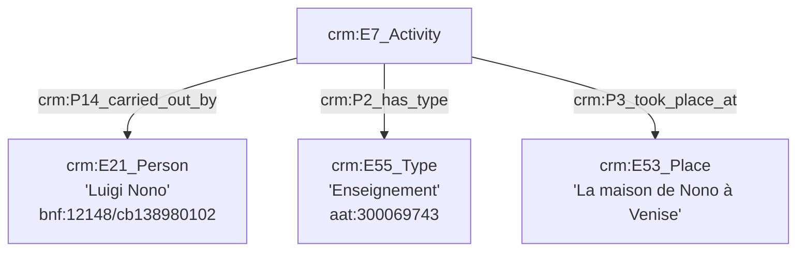

```mermaid
graph TD;


A[crm:E7_Activity] --> |crm:P14_carried_out_by| B[crm:E21_Person<br>'Luigi Nono'<br>bnf:12148/cb138980102]
A[crm:E7_Activity] --> |crm:P2_has_type| C[crm:E55_Type<br>'Composition musicale (activité)'<br>aat:300264878]

D[crm:E65_creation] --> |crm:P94_has_created| E[crm:E28_Conceptual_Object<br>'Prometeo'<br>rism:850817313]
E[crm:E28_Conceptual_Object<br>'Prometeo'] --> |crm:P2_has_type| F[crm:E55_Type<br>'Composition musicale (œuvre)'<br>aat:300264878]


```


