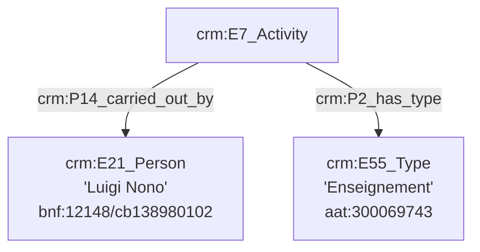

```mermaid
graph TD;


A[crm:E7_Activity] --> |crm:P14_carried_out_by| B[crm:E21_Person<br>'Luigi Nono'<br>bnf:12148/cb138980102]
A[crm:E7_Activity] --> |crm:P2_has_type| C[crm:E55_Type<br>'Enseignement'<br>aat:300069743]


```
