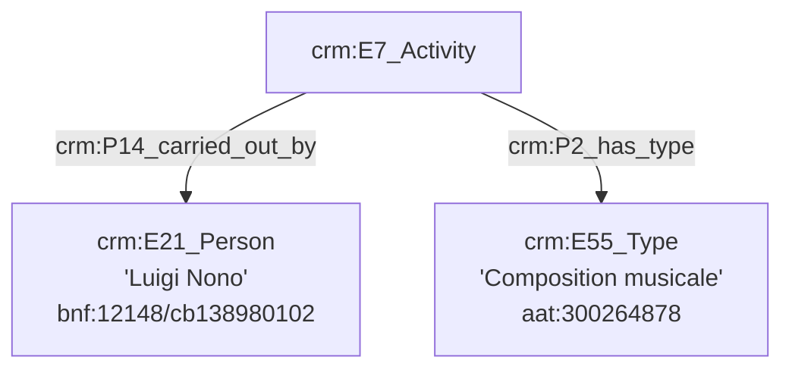
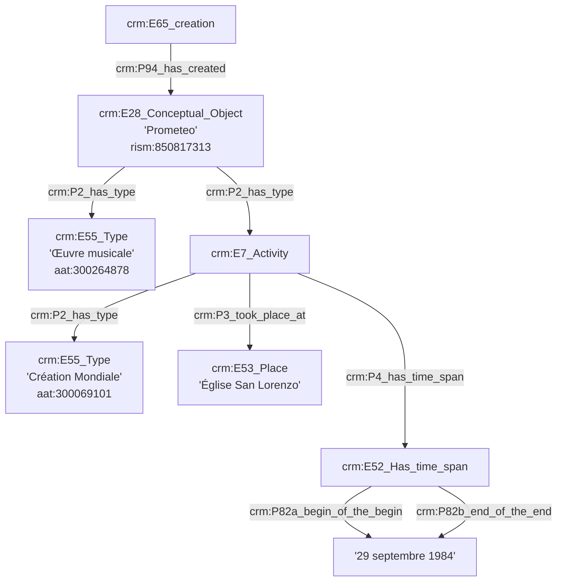
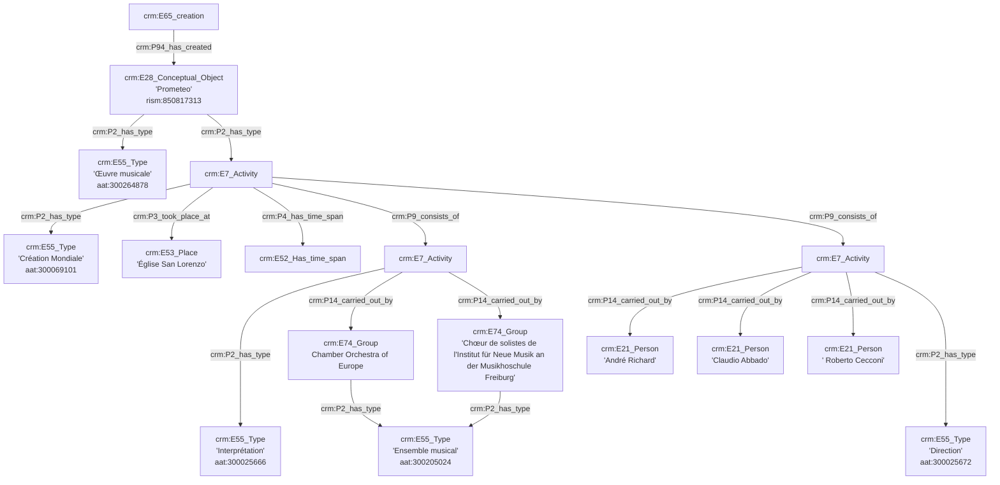
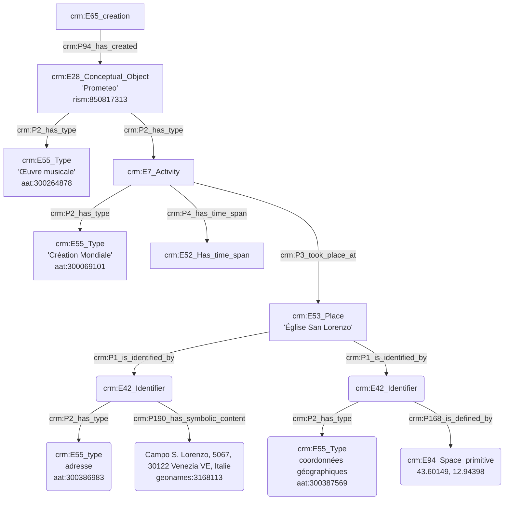
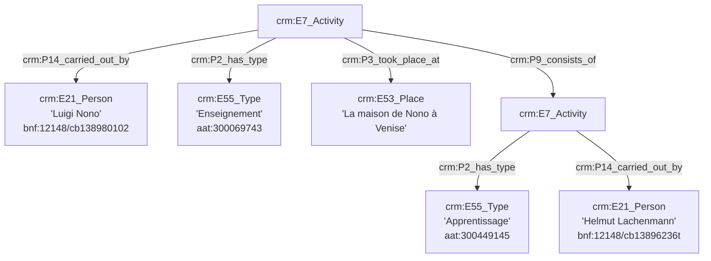

**Composition d'une œuvre**




**Date de création d'une œuvre**


**Personnes ayant créées l'œuvre**



**Lieu de création d'une œuvre**


**Vie privée de Luigi Nono**

```mermaid
graph TD;

A[crm:E21_Person<br>'Luigi Nono'<br>bnf:12148/cb138980102] --> |crm:P98_was_born| B[crm:E67_Birth]
A[crm:E21_Person<br>'Luigi Nono'<br>bnf:12148/cb138980102] --> |crm:P100_died_in| C[crm:E69_Death]
D[crm:E85_joining] --> |crm:P143_joined| A[crm:E21_Person<br>'Luigi Nono'<br>bnf:12148/cb138980102]
D[crm:E85_joining] --> |crm:P143_joined|
E[crm:E21_Person<br>'Nuria Nono-Schönberg'<br>bnf:12148/cb123338502]
E[crm:E21_Person<br>'Nuria Nono-Schönberg'<br>bnf:12148/cb123338502] --> |crm:P98_was_born| F[crm:E67_Birth]
E[crm:E21_Person<br>'Nuria Nono-Schönberg'<br>bnf:12148/cb123338502] --> |crm:P100_died_in| G[crm:E69_Death]
D[crm:E85_joining] --> |crm:P144_joined_with| H[crm:E74_Group]
H[crm:E74_Group] --> |crm:P2_has_type| I[crm:E55_Type<br>'marriage (social construct)'<br>aat:300055475]

```

**Enseignement de la composition à Helmut Lachenmann**


