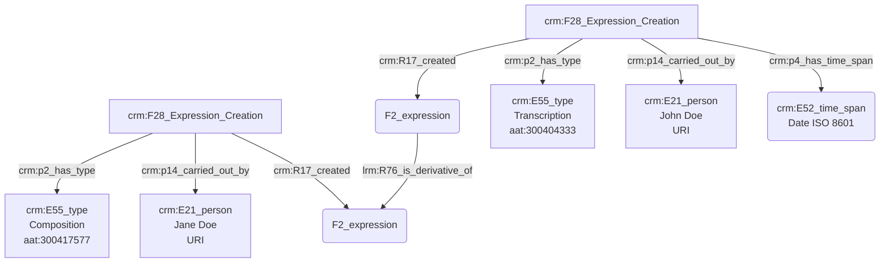

```mermaid
graph TD;

E[crm:F28_Expression_Creation] --> |crm:p2_has_type| G[crm:E55_type<br>Composition<br>aat:300417577]
E[crm:F28_Expression_Creation] --> |crm:p14_carried_out_by| F[crm:E21_person<br>Jane Doe<br>URI]
E[crm:F28_Expression_Creation] --> |crm:R17_created| M(F2_expression)

N(F2_expression) --> |lrm:R76_is_derivative_of| M(F2_expression)
A[crm:F28_Expression_Creation] --> |crm:R17_created| N(F2_expression)

A[crm:F28_Expression_Creation] --> |crm:p2_has_type| B[crm:E55_type<br>Transcription<br>aat:300404333]
A[crm:F28_Expression_Creation] --> |crm:p14_carried_out_by| C[crm:E21_person<br>John Doe<br>URI]
A[crm:F28_Expression_Creation] --> |crm:p4_has_time_span| I(crm:E52_time_span<br>Date ISO 8601)


```
