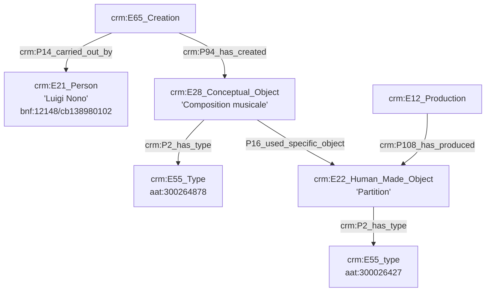
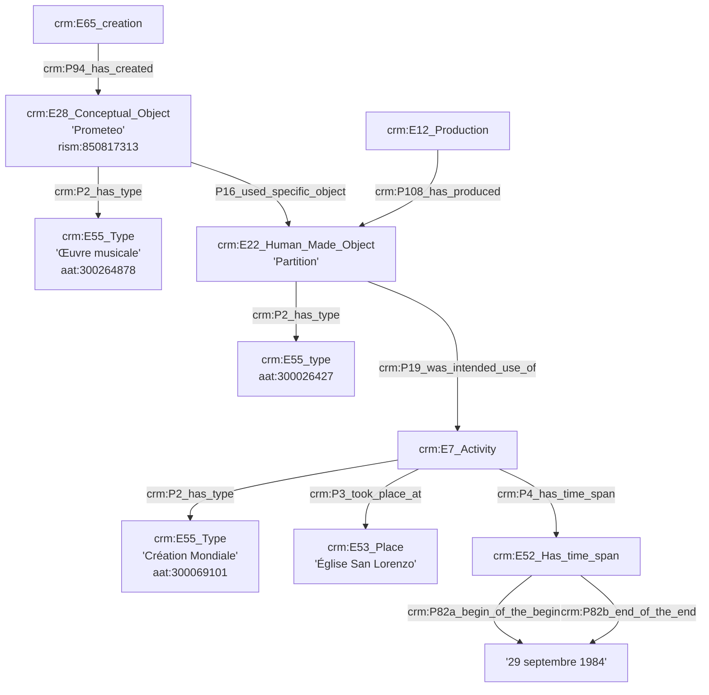
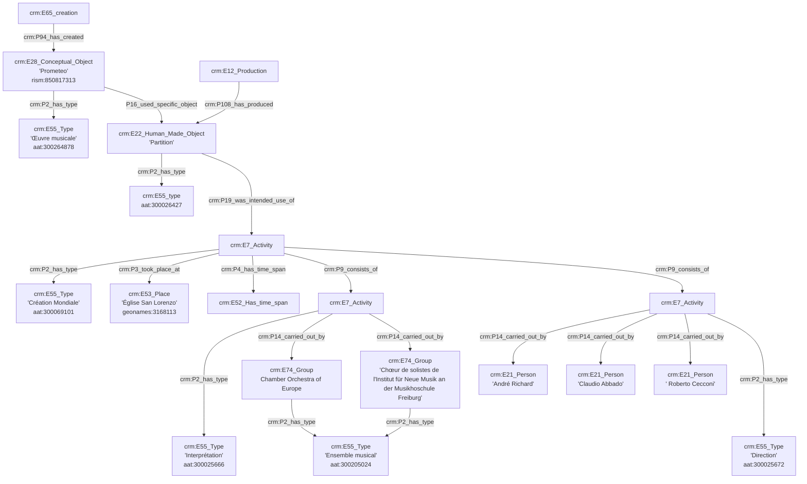
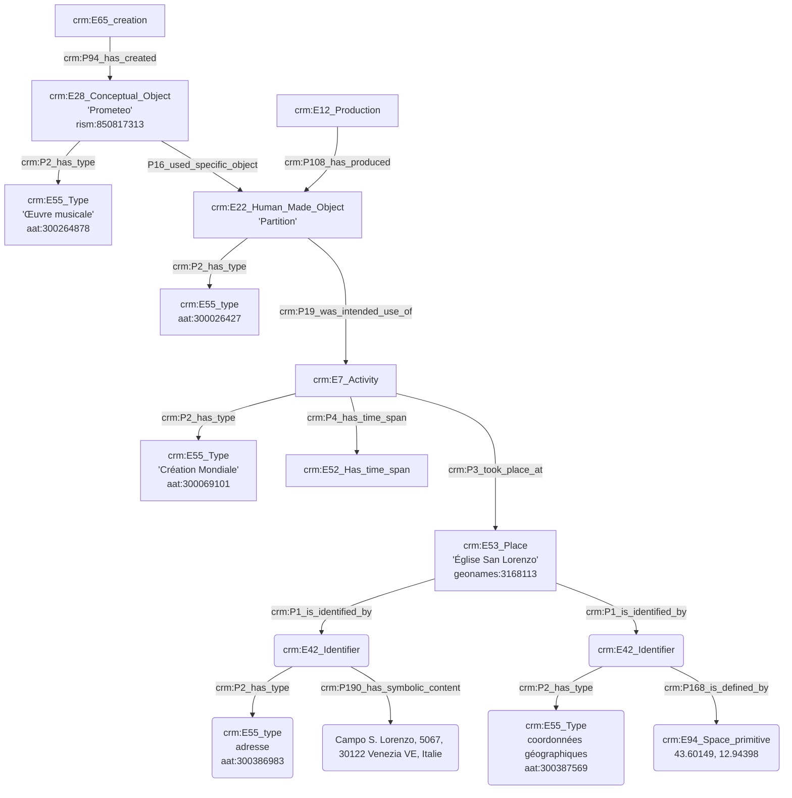
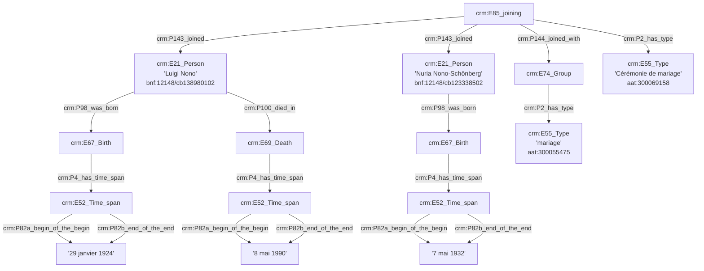
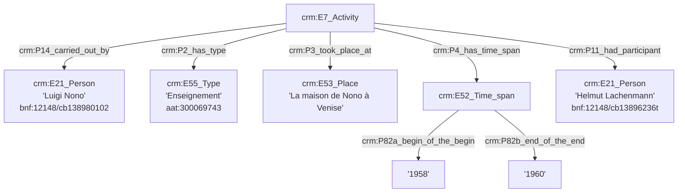

**Composition d'une œuvre**

**Date de création d'une œuvre**

**Personnes ayant créées l'œuvre**

**Lieu de création d'une œuvre**

**Vie privée de Luigi Nono**

**Enseignement de la composition à Helmut Lachenmann**

